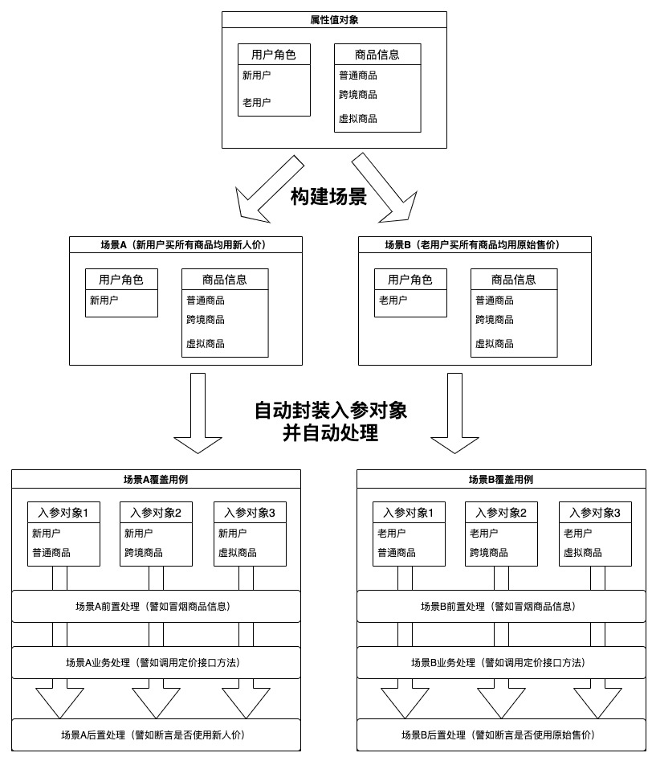

## 项目介绍
case-test 

[](https://search.maven.org/artifact/io.github.wesleyone/case-test/2.0/jar)
[](https://github.com/WesleyOne/case-test/releases)
[](https://www.apache.org/licenses/LICENSE-2.0.html)

### 背景
在做定价接口的逻辑调整时，发现测试用例非常多（用户角色、活动、营销等多维度聚合），用例预期结果具有大量重复，逐个写单测代码量巨大且效率低。

### 功能
针对单一功能、大量业务场景的接口，通过**自动封装入参对象**，将相同结果的入参对象**聚合到同一场景**中来处理，简化测试代码量（主要是重复封装入参对象和同样的冒烟断言等代码），提高开发效率。

## 框架介绍
### 概念
- 入参对象: 业务接口的入参对象；
- 属性值对象：入参对象有多个属性，每个属性有多种值，属性值对象用来维护某个属性的所有值；
- 场景：具有业务上相同结果的入参对象集合；

### 核心
- 自动封装入参对象
- 聚合到同一场景来处理

### 示意图



## 使用介绍

#### 1. 添加maven依赖
```xml
<!-- https://mvnrepository.com/artifact/io.github.wesleyone/case-test -->
<dependency>
    <groupId>io.github.wesleyone</groupId>
    <artifactId>case-test</artifactId>
    <version>2.0</version>
    <scope>test</scope>
</dependency>
```

#### 2. 构建**属性值对象**

参考在本项目中的如下测试代码：

`io.github.wesleyone.cases.test.GoodInfoParam`
`io.github.wesleyone.cases.test.IsNewUserParam`
   
将相应接口入参对象需要用到的属性分别新建**属性值对象**
 - 实现`io.github.wesleyone.cases.test.IParam`接口 
 - 通过方法形式构建对应的属性值

#### 3. 实现测试启动类

参考在本项目中的如下测试代码：

`io.github.wesleyone.cases.test.PriceContextTestBoostrap`

新建启动类实现`io.github.wesleyone.cases.test.TestBootstrap`，继承`io.github.wesleyone.cases.test.TestBootstrap`类，并实现`newBizContext`、`setProperties`、`handle`自定义方法
`newBizContext`方法：实例业务上下文对象
`setProperties`方法：自定义设置属性
`handle`方法：自定义接口方法处理

#### 4. 构建场景方法

参考在本项目中的如下测试代码：

`io.github.wesleyone.cases.test.PriceContextTestBoostrap`

实现**前置方法**、**后置方法**

```java
public class PriceContextTestBoostrap extends TestBootstrap<PriceContext> {
    
    /**
     * 前置处理方法，可以没有
     * 命名要求如下：
     * before_{对应后置处理方法}
     *
     * @param context 场景上下文
     */
    public void before_newUserAllGoods(TestCaseContext<PriceContext> context) {
        System.out.println("newUserAllGoods前置处理，可以在此处初始化MOCK数据等");
    }

    /**
     * 后置处理方法
     * 注解部分指定入参的属性范围
     * 方法内容实现具体的后置处理
     *
     * @param context 场景上下文
     */
    @TestCase(name = "新用户购买所有商品", desc = "使用新人价",params = {
            @TestParam(clazz = IsNewUserParam.class, in = "newUser"),
            @TestParam(clazz = GoodInfoParam.class),
    })
    public void newUserAllGoods(TestCaseContext<PriceContext> context) {
        System.out.println("newUserAllGoods后置处理，可以在此处断言校验等");
    }
}
```

#### 5. 开始执行

添加测试入口方法如下，其中`run()`方法是`TestBootstrap`父类的启动方法
```
    @Test
    public void test() {
        run();
    }
```
运行该测试入口方法，则会将当前类的所有场景跑一边。

> 建议将场景方法按业务场景分开到多个类，然后这些类共同继承上文的测试启动类。


## 缺陷
1. 属性值对象不支持MAP属性（业务接口入参属性原则上不允许MAP类型）
2. 其他缺陷
